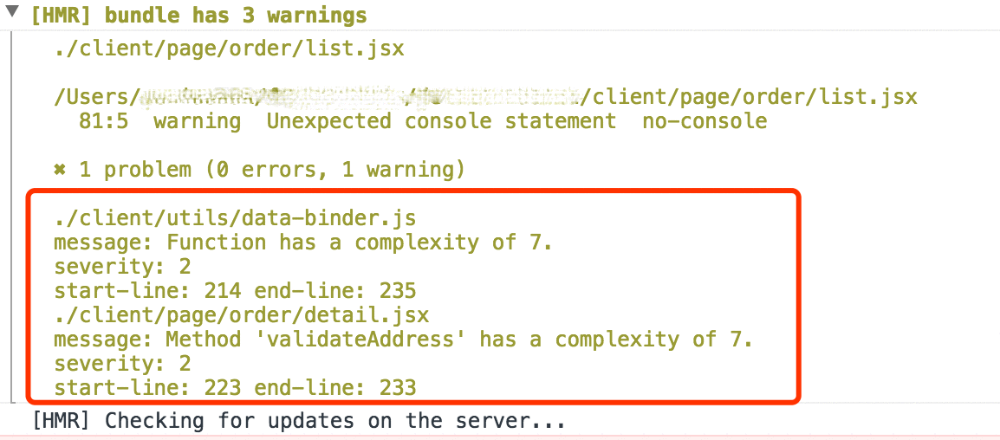

# cqc-loader
cqc loader (for webpack)

## 目的

在webpack中直接去校验每个文件的圈复杂度，让coder在调试过程中就对代码的质量有一个清醒的认识，故在webpack中集成了cqc的webpack loader。
bundle过程中达到的效果：

- 在终端信息中，显示出warning信息
- 在浏览器控制台信息中，显示出warning信息

下面介绍如何集成cqc-loader
## 第一步

使用以下命令下载cqc-loader：

```
npm install cqc-loader --save-dev
```

以上命令将在 package.json 中添加以下依赖

```
"cqc-loader": "^0.1.2",
```
 
## 第二步
在webpack.config.js中集成
这里分成webpack V1 和 webpack V2及以上（V2及以上还没测过。。。如有问题请提issue）

```
// webpack V1 的配置
module: {
      loaders: [
        {
          test: /\.jsx?$/,
          loader: '@mtfe/cqc-loader',
          exclude: /node_modules/,
          query: {
            //这里的complexity参数是最大复杂度的上限，如果不设置，默认为10
            complexity: 6
          }
        },
...
  
// webpack V2 及以上的配置
module: {
    // 将 loaders 换成 rules 就行
    rules: [
      {
          test: /\.jsx?$/,
          loader: '@mtfe/cqc-loader',
          exclude: /node_modules/,
          query: {
            //这里的 complexity 参数是最大复杂度的上限，如果不设置，默认为10
            complexity: 6
          }
        },
...
```

## 效果
### 终端信息
<p align="center">
  
</p>

### 浏览器控制台信息
<p align="center">
  
</p>